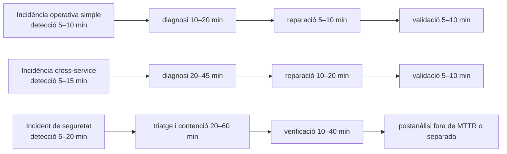

# Informe analític sobre temps manuals de resolució d’incidències per estimar els casos Loki

## Resum executiu

La literatura oberta i realment útil per al teu objectiu **no acostuma a publicar “temps manuals” exactes per incidents petits i autoallotjats idèntics als teus Loki**. El que sí que publica, amb bastanta solidesa, és una combinació de: temps absoluts en alguns postmortems oficials, reduccions absolutes o relatives obtingudes quan s’automatitza la detecció o la triatge, i dades sobre com els errors de triatge, la complexitat cross-service i els incidents de seguretat allarguen fortament el temps total de mitigació. Això permet construir estimacions defensables per a O6, sempre que les presentis com a **estimacions inferides** i no com a mesures directes del mateix incident. citeturn48view0turn58view0turn60view3turn22view0turn59view0turn53news0turn30news1

Els millors ancoratges absoluts que he trobat són aquests. En un postmortem oficial de Google sobre una fallada de configuració, els errors d’usuari van començar a ser visibles a les 11:02, la monitorització va alertar l’equip SRE en aquell moment, 12 minuts després encara estaven depurant, i la configuració correcta ja s’estava propagant a les 11:14; a les 11:30 gairebé tots els usuaris ja havien recuperat el servei. En Walmart, una capa d’anomalia va reduir el MTTD en **més de 7 minuts** durant una validació de 3 mesos que cobria 63% dels incidents majors observats. En Alibaba, la localització típica de causa arrel va passar de **30 minuts a 5 minuts** quan es va automatitzar la RCA de microserveis. citeturn48view0turn60view3turn58view0

Per a incidents cross-service i de connectivitat, les evidències de Microsoft Azure són especialment útils. El treball DeepTriage indica que una assignació incorrecta pot incrementar el temps de mitigació en **més de 10×**, i el treball COT mostra que, en més del **52%** de les aturades analitzades, el servei on “es manifesta” l’outage no és el servei causa arrel; a més, el nombre mitjà de reassignacions és proper a 1. Això és exactament el tipus de fricció que fa pujar el temps manual en casos semblants a **DB Firewall Disconnection**. citeturn22view0turn16view0

Per a incidents de seguretat, la literatura oberta és molt més severa que la d’operacions. Segons una síntesi d’ITPro basada en el **Check Point Cloud Security Report 2025**, només el **9%** dels incidents cloud es detecten dins la primera hora, només el **6%** es remediaven dins la primera hora, i el **62%** trigaven més de 24 hores a recuperar-se completament. I, segons una síntesi d’ITPro basada en l’**IBM Cost of a Data Breach 2025**, les organitzacions amb IA/automatització tenien un temps mitjà d’identificació de **148 dies** davant de **168 dies** sense aquestes capacitats, i un temps de contenció de **42 dies** davant de **64 dies**. Això no vol dir que el teu **Loki 4** hagi de durar dies en un laboratori; el que vol dir és que, fins i tot en entorns més controlats, **els incidents de seguretat no s’han d’estimar amb la mateixa escala temporal que un error de sintaxi d’Nginx**. citeturn53news0turn30news1turn65view0

La proposta més prudent, aplicable a O6, és usar **rang estimat + valor central** per cada Loki. Amb aquesta aproximació, les estimacions manuals recomanades queden aproximadament així: **Loki 1: 20–40 min**, **Loki 2: 35–80 min**, **Loki 3A: 30–65 min**, **Loki 3B: 45–90 min**, **Loki 4: 45–120 min per contenció efectiva** i **2–8 h si hi incorpores revisió forense/manual completa**, **Loki 5: 35–75 min**. Aquestes franges surten de combinar els ancoratges absoluts anteriors amb la naturalesa de cada cas i amb el fet que el teu entorn és de laboratori autoallotjat i no una plataforma massiva amb múltiples equips i handoffs continus. citeturn48view0turn58view0turn60view3turn22view0turn16view0turn53news0turn30news1turn59view0

Aquesta descomposició resumeix la lògica que surt de la bibliografia: en incidents simples, el coll d’ampolla és sobretot la detecció i la verificació; en incidents cross-service, el coll d’ampolla és la diagnosi; en seguretat, el coll d’ampolla és la combinació de detecció, decisió de contenció i validació posterior. citeturn48view0turn58view0turn22view0turn16view0turn53news0turn30news1turn57news0

## Evidència empírica localitzada

El postmortem oficial de Google és el millor exemple obert que he trobat per a una fallada de **configuració** amb temps absoluts. El sistema defectuós va començar a generar configuracions incorrectes a les 10:55; els usuaris van veure errors a les 11:02; en aquell moment la monitorització va alertar l’equip SRE; 12 minuts després, els enginyers encara estaven depurant; la configuració correcta va començar a propagar-se a les 11:14; i a les 11:30 gairebé tot el servei s’havia restaurat. És un cas de gran escala, però serveix molt bé com a **límit inferior raonable** per a incidents de configuració o sintaxi que en un laboratori també es detecten per logs i es resolen amb rollback o correcció de fitxer. citeturn48view0

Els treballs d’operacions en microserveis mostren que, quan la fallada ja és visible, el gran cost manual no és tant “fer la comanda”, sinó **trobar amb confiança la causa arrel**. En Alibaba, MicroHECL redueix la localització típica de causa arrel de **30 minuts a 5 minuts** i s’ha desplegat sobre més de **600 availability issues**. En Walmart, AIDR redueix el MTTD en **més de 7 minuts** sobre una validació de 3 mesos, amb més de **3000 models**, més de **25 equips** i cobertura del **63%** dels incidents majors. Aquestes dues xifres són especialment útils per justificar que, en absència d’automatització, la suma **detecció + RCA** pot menjar-se entre una desena de minuts i mitja hora fins i tot abans de reparar res. citeturn58view0turn60view3

La bibliografia de Microsoft Azure reforça el mateix patró i l’explica millor en casos de dependències. DeepTriage indica que una assignació incorrecta pot fer créixer el **time to mitigate** en més de **10×**. El treball COT, també sobre Azure, assenyala que el servei origen i el servei causa arrel són diferents en **més del 52%** dels outages analitzats, i que la cadena de reassignacions és una font directa d’allargament del temps manual. Per a un únic administrador de laboratori això no implica “handoff entre equips”, però sí el mateix cost cognitiu: has d’anar del símptoma d’aplicació al host de base de dades, a la taula de filtre, a la prova de connexió, etc. citeturn22view0turn16view0

Els estudis més recents d’automatització d’investigacions no sempre publiquen el temps absolut manual, però sí quantifiquen com de gran és la càrrega humana substituïda. A Meta, DrP descriu investigacions manuals que poden portar **hores o dies** de triatge/depuració i informa d’una reducció mitjana del **20%** del MTTR, amb equips concrets superant el **80%**. En Adobe, un sistema d’alert triage automatitzat informa d’una reducció del **90%** en el *mean time to insight* respecte del triatge manual. I en un benchmark controlat sobre una demo de **24 microserveis**, Causely redueix el temps mitjà de diagnosi en **63%**. La lectura pràctica per al teu O6 és clara: quan la part “intel·ligent” del teu sistema fa triatge, correlació i proposta, el benefici esperable és sobretot sobre **diagnosi**, no només sobre el gest final de reparar. citeturn59view0turn4academia3turn60view0

Per a seguretat, les fonts obertes utilitzables per estimació són més “macro”, però no s’han d’ignorar. El resum d’ITPro del Check Point Cloud Security Report 2025 indica que només el **9%** dels incidents cloud es detecten dins la primera hora i només el **6%** es remedia dins la primera hora; el **62%** tarda més de 24 hores en recuperar-se del tot. IBM, a la seva pàgina oficial del Cost of a Data Breach 2025, remarca que la reducció de costos està impulsada per una **identificació i contenció més ràpides**; i la síntesi periodística del mateix informe dona valors de **148 dies vs 168 dies** per identificar i **42 dies vs 64 dies** per contenir, amb i sense AI/automation. Finalment, CrowdStrike situa l’**eCrime breakout time** mitjà de 2025 en **29 minuts**, amb un cas de **4 minuts** fins a exfiltració i un mínim observat de **27 segons**. Tot plegat no et serveix per dir que el teu SQL injection en laboratori durarà dies, però sí per **justificar metodològicament** que el Loki 4 s’ha d’estimar com a cas diferent de la resta i que, si mesures “resolució completa”, cal separar **contenció** de **tancament forense**. citeturn53news0turn65view0turn30news1turn57news0

## Taula de fonts i mètriques extretes

| Font | Tipus de font | Entorn i mostra | Detecció | Diagnosi | Reparació o contenció | MTTR o temps total | Variància / percentils | Retards humans / aprovacions | Aplicabilitat als Loki |
|---|---|---|---|---|---|---|---|---|---|
| Google, *Today’s outage for several Google services* | Postmortem oficial | Producció Google; mostra no especificada | Errors visibles a les 11:02; alerta SRE al mateix moment | 12 min després de l’alerta encara depurant | Configuració correcta propagant-se a les 11:14 | Quasi restaurat a les 11:30 | No especificat | No especificat | Molt alta per **Loki 1** i útil com a mínim per **Loki 3A/3B** citeturn48view0 |
| Liu et al., *MicroHECL* | Research paper / deployment paper | Alibaba; desplegat sobre >600 incidents de disponibilitat | Depèn del monitor run-time; no dona xifra absoluta | RCA típica passa de 30 min a 5 min | No especificat | No especificat | No especificat | No especificat | Molt alta per **Loki 2** i **Loki 5**, i com a referència general de diagnosi manual citeturn58view0 |
| Wang et al., *AIDR* | Workshop / industrial paper | Walmart; 3 mesos, >3000 models, >25 equips, 63% d’incidents majors | MTTD reduït en >7 min | No especificat | No especificat | No especificat | No especificat | No especificat | Alta per estimar **MTTD manual** en **Loki 1, 2, 3 i 5** citeturn60view3 |
| Pham et al., *DeepTriage* | KDD industrial paper | Microsoft Azure; “hundreds of thousands of incidents”, milers d’equips | No especificat | Assignació incorrecta pot multiplicar el TTM per >10× | No especificat | Afecta TTM, no dona valor absolut | No especificat | Handoffs entre equips implícits | Molt alta per **Loki 2** i moderada per **Loki 4** quan l’origen no és evident citeturn22view0 |
| Wang et al., *COT* | ICSE paper | Microsoft Azure; 1 any de dades, mostra exacta no oberta | No especificat | >52% dels outages tenen servei origen diferent del causa arrel; reassignacions mitjanes ~1 | COT pot fer triatge d’outage en <1 min | Temps manual absolut no obert | No especificat | Reassignacions humanes implícites | Alta per **Loki 2** i com a prova que els casos cross-service penalitzen fort el procés manual citeturn16view0 |
| Somani et al., *DrP* | Research / production experience paper | Meta; 300+ equips, 2000+ analyzers, 50K anàlisis/dia | Alert-driven | Investigacions manuals descrites com hores/dies | Accions de mitigació automatitzades via playbooks | MTTR mitjà -20%; alguns equips >80% | No especificat | No quantificat, però dependència d’experts i playbooks manuals | Alta per explicar per què la part manual de triatge/documentació pesa tant en tots els **Loki** citeturn59view0 |
| Bharadwaj i Tu, *Agentic Observability* | Research paper | Adobe e-commerce en producció; mostra no especificada | Alert-driven | Mean time to insight -90% versus manual triage | No especificat | No especificat | No especificat | No especificat | Alta com a prova addicional que la **diagnosi manual** és el gran coll d’ampolla citeturn4academia3 |
| Dalal et al., *Causely* | Research benchmark paper | Demo controlada de 24 microserveis | No especificat | Temps mitjà de diagnosi -63% | No especificat | No especificat | No especificat | No especificat | Molt útil per a entorns de laboratori sobre **Loki 2, 3 i 5** citeturn60view0 |
| Check Point Cloud Security Report 2025 via ITPro | Informe d’indústria resumit per premsa | Organitzacions cloud; mostra no indicada a l’article | 9% detectat dins 1 h | No especificat | 6% remediat dins 1 h | 62% >24 h per recuperació completa | No especificat | No especificat | Alta per **Loki 4** com a context de severitat i per defensar que cal separar contenció de resolució completa citeturn53news0 |
| IBM / Ponemon Cost of a Data Breach 2025 | Informe oficial + resum premsa per xifres temporals | IBM: informe global; TechRadar resumeix 600 organitzacions | MTTI 148 dies amb IA/automatització vs 168 dies sense | No especificat | MTTC 42 dies vs 64 dies | Temps de contenció, no MTTR operatiu | No especificat | No especificat | Context macro per **Loki 4**; no s’ha d’usar directament com a temps del laboratori, però sí com a justificació de complexitat de seguretat citeturn65view0turn30news1 |
| CrowdStrike Global Threat Report 2026 via TechRadar | Vendor threat report resumit per premsa | Període abril 2025–març 2026 | No és MTTD defensiu; és temps adversari | No especificat | Inicial access → lateral movement | Breakout mitjà 29 min; cas de 4 min fins exfiltració; mínim 27 s | No especificat | No especificat | Complementari per **Loki 4** per justificar finestres de resposta molt curtes en incidents maliciosos citeturn57news0 |

## Estimacions recomanades per als casos Loki

Per fer O6, et recomano definir **temps manual** com el temps necessari per arribar des del primer símptoma o alerta fins que el servei torna a estar funcional i validat tècnicament. Aquesta definició és coherent amb la forma com DrP descriu l’MTTR, és a dir, el temps mitjà per triatjar i mitigar l’incident abans que el sistema torni a estar sa. La documentació generada millor tractar-la com a **mètrica separada de qualitat o temps addicional**, perquè moltes fonts no l’inclouen dins MTTR. citeturn59view0

| Escenari | Categoria | MTTD manual suggerit | Diagnosi manual suggerida | Reparació o contenció manual suggerida | MTTR manual suggerit | Valor central recomanat | Comentari de justificació |
|---|---|---:|---:|---:|---:|---:|---|
| **Loki 1 — Nginx Syntax Error** | Error de configuració / servei que no arrenca | 5–10 min | 10–20 min | 5–10 min | **20–40 min** | **30 min** | El millor ancoratge és el postmortem de Google: alerta en 7 min, 12 min addicionals de depuració i restauració poc després; Walmart afegeix que només la capa de detecció automàtica ja estalvia >7 min en incidents majors. citeturn48view0turn60view3 |
| **Loki 2 — DB Firewall Disconnection** | Connectivitat cross-host / dependència | 5–15 min | 20–45 min | 10–20 min | **35–80 min** | **55 min** | Aquí pesa la diagnosi cross-service: Azure mostra que servei origen i causa arrel divergeixen sovint, i DeepTriage diu que la mala assignació pot disparar el TTM >10×; Alibaba situa la RCA manual típica al voltant de 30 min. citeturn16view0turn22view0turn58view0 |
| **Loki 3A — SSL/TLS expiració amb certificat existent** | Problema de certificat / configuració | 5–15 min | 15–30 min | 10–20 min | **30–65 min** | **45 min** | No he trobat una sèrie oberta bona amb temps manuals exactes per aquest cas; la millor inferència és combinar el patró de fallades de configuració de Google amb el fet que el certificat correcte ja existeix i la reparació és majoritàriament de localització + reconfiguració + reload. citeturn48view0turn59view0 |
| **Loki 3B — SSL/TLS expiració sense certificat disponible** | Problema de certificat amb reemissió | 5–15 min | 15–30 min | 20–45 min | **45–90 min** | **70 min** | Respecte 3A, el temps extra ve de generar nou certificat, desplegar-lo, validar cadenes i comprovar el servei. La literatura oberta no dona un MTTR manual equivalent; aquesta és una inferència de descomposició de tasques amb suport dels ancoratges de configuració i de triatge. citeturn48view0turn59view0 |
| **Loki 4 — SQL Injection** | Incident de seguretat / contenció | 5–20 min | 20–60 min | 10–40 min | **45–120 min** per contenció efectiva | **75 min** | Les dades obertes de seguretat són molt més lentes a escala real, però el teu cas és una simulació acotada d’un patró concret i amb resposta prevista. Per això recomano **dues mètriques**: “temps fins contenció efectiva” (rang anterior) i, separat, “temps fins tancament complet/manual”, que fàcilment pot ser **2–8 h** si inclous revisió de logs, comprovacions addicionals i documentació de l’incident. citeturn53news0turn30news1turn57news0 |
| **Loki 5 — Disk Full** | Esgotament de recursos | 5–15 min | 15–30 min | 15–30 min | **35–75 min** | **55 min** | És menys ambigu que Loki 2 però més laboriós que Loki 1: detectar capacitat, trobar causa concreta, alliberar espai sense danyar dades, i verificar que el servei es recupera. La base empírica més propera és el cost típic de RCA manual en sistemes instrumentats i el guany de detecció de Walmart. citeturn58view0turn60view3 |

La clau perquè això et quedi **acadèmicament robust** és deixar molt clar al text que aquestes xifres són **estimacions derivades** de literatura propera, i no pas una mesura directa dels teus cinc incidents sobre un grup de control humà. Si ho escrius així, el tribunal normalment ho veu com una decisió metodològica responsable: és millor una estimació ben justificada que una comparació “manual” inventada sense base. citeturn48view0turn58view0turn59view0turn53news0

## Metodologia i límits

He prioritzat fonts **primàries o quasi primàries** que donessin almenys una de les peces següents: un temps absolut d’incident, una reducció absoluta en minuts, una reducció percentual de diagnosi/MTTR, o una caracterització empírica de com la triatge manual allarga la mitigació. Quan no hi havia una font oberta amb el mateix incident, he fet una **traslació per analogia operacional**: fallada de configuració → ancoratge Google; microservei/cross-service → ancoratges Alibaba i Azure; detecció operacional → ancoratge Walmart; seguretat/contenció → ancoratges Check Point, IBM i CrowdStrike. citeturn48view0turn58view0turn60view3turn22view0turn16view0turn53news0turn30news1turn57news0

Aquesta metodologia és més sòlida per al teu cas perquè el teu projecte no vol demostrar una llei universal de l’SRE, sinó defensar una comparació plausible per a **un laboratori autoallotjat**, amb cinc incidents controlats i una arquitectura concreta. En aquest context, els grans entorns productius serveixen com a **evidència de forma del procés** i com a **límit superior de complexitat**, mentre que els benchmarks controlats en demos de 24 microserveis s’assemblen més al teu entorn i rebaixen el risc d’extrapolar massa. citeturn59view0turn60view0

També és important explicitar els límits. No he localitzat, en obert, estudis autoritatius que donin exactament “MTTR manual d’un Nginx amb certificat caducat en un petit laboratori” o “temps manual per resoldre un disk full sobre PostgreSQL autoallotjat” amb mostra i percentils. Per tant, per **Loki 3** i **Loki 5**, les estimacions són necessàriament més inferencials que per **Loki 1**, **Loki 2** o la part de **contenció** de **Loki 4**. On les fonts no donen variància o percentils, ho he marcat com a **no especificat**. citeturn48view0turn58view0turn53news0

Si ho vols redactar de manera especialment fina dins la memòria, pots presentar O6 amb tres nivells: **temps fins detecció**, **temps fins recuperació/contenció efectiva**, i **qualitat/temps de documentació**. Això t’evita barrejar una mètrica estrictament operativa amb una mètrica de traçabilitat que la bibliografia sovint tracta per separat. És, de fet, una manera més neta de defensar el valor d’un sistema que no només repara, sinó que també genera suport al troubleshooting i documentació útil. citeturn59view0turn4academia3

## Enllaços directes a les fonts

| Font | Tipus | Enllaç directe |
|---|---|---|
| Google — *Today’s outage for several Google services* | Postmortem oficial | `https://blog.google/company-news/inside-google/company-announcements/todays-outage-for-several-google/` |
| Liu et al. — *MicroHECL* | Research / industrial deployment | `https://arxiv.org/abs/2103.01782` |
| Wang et al. — *Anomaly Detection for Incident Response at Scale* | Workshop / industrial paper | `https://arxiv.org/abs/2404.16887` |
| Pham et al. — *DeepTriage* | KDD industrial paper | `https://arxiv.org/abs/2012.03665` |
| Wang et al. — *Fast Outage Analysis of Large-scale Production Clouds with Service Correlation Mining* | ICSE paper | `https://arxiv.org/abs/2103.03649` |
| Somani et al. — *DrP* | Research / production experience paper | `https://arxiv.org/abs/2512.04250` |
| Bharadwaj i Tu — *Agentic Observability* | Research paper | `https://arxiv.org/abs/2602.02585` |
| Dalal et al. — *Causely* | Research benchmark paper | `https://arxiv.org/abs/2605.18327` |
| ITPro — resum del *Check Point Cloud Security Report 2025* | Premsa especialitzada sobre informe d’indústria | `https://www.itpro.com/cloud/cloud-security/cloud-security-how-to-detect-breaches-and-stop-them-quickly` |
| IBM — *Cost of a Data Breach Report 2025* | Informe oficial | `https://www.ibm.com/reports/data-breach` |
| TechRadar — resum amb xifres temporals de l’IBM/Ponemon 2025 | Premsa especialitzada | `https://www.techradar.com/pro/security/ai-means-data-breaches-now-cost-much-less-but-theyre-still-a-huge-threat-to-businesses` |
| TechRadar — resum del *CrowdStrike 2026 Global Threat Report* | Premsa especialitzada sobre vendor report | `https://www.techradar.com/pro/security/crowdstrike-says-attackers-are-moving-through-networks-in-under-30-minutes` |
| Reuters — resum del *Verizon DBIR 2026* | Agència de notícies sobre informe d’indústria | `https://www.reuters.com/world/ai-related-data-breaches-surpass-stolen-credentials-cyber-incidents-verizon-2026-05-19/` |

En conjunt, la base més defensable per a la teva memòria és aquesta: usar els estudis i postmortems anteriors per construir **estimacions manuals prudents, explícitament inferides i acotades per rang**, i no presentar-les com si fossin temps observats directament en un grup de control humà. Si ho formules així, O6 queda molt més sòlid del punt de vista metodològic. citeturn48view0turn58view0turn60view3turn22view0turn16view0turn59view0turn53news0turn30news1turn57news0